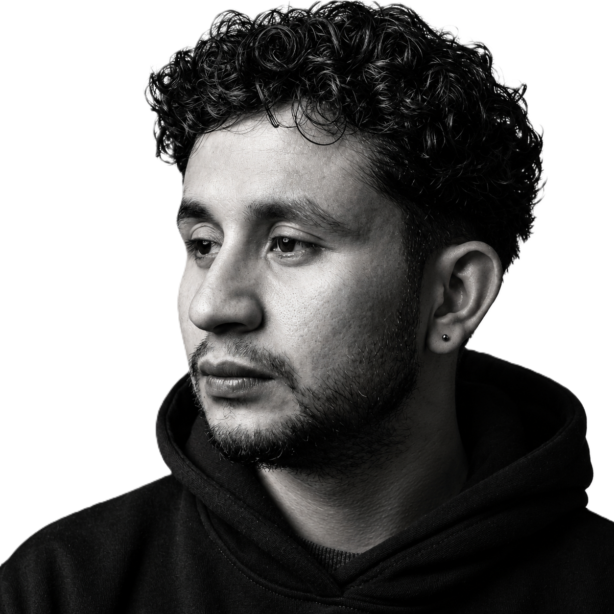

# THE BHABISHYA Portfolio

A multi-page portfolio starter based on the supplied visual direction:
- White canvas
- Thin editorial grid
- Black typography
- Red accent
- Large type
- Minimal navigation
- Brutalist/editorial layout
- Responsive mobile menu

## Files
- index.html       Home
- works.html       Portfolio / projects
- about.html       About / process
- services.html    Services
- contact.html     Contact form
- wallpapers.html  Wallpaper upload and download gallery
- admin.html       Admin-only upload workspace placeholder
- style.css        Shared design system
- script.js        Mobile navigation + reveal animations

## Story and wallpapers
The home page now includes a short story section with the supplied portrait. The Wallpaper page supports JPG, PNG and WEBP uploads in the current browser and creates download links for them.

The public browser gallery is download-only. `admin.html` now uses the server login and upload API.

## Run the dynamic site
1. Copy `.env.example` to `.env` and set a strong `ADMIN_PASSWORD` and `SESSION_SECRET`.
2. Run `npm install`.
3. Run `npm start` and open `http://localhost:3000`.

The server protects admin sessions with HttpOnly cookies, rate-limits login and uploads, validates JPG/PNG/WEBP MIME types, limits files to 8 MB, stores metadata outside the public HTML, and serves uploaded files from generated names. Use HTTPS and a managed database/object store for production deployments.

## Add your portrait
Create:
assets/profile.png

Then replace each `.portrait-placeholder` block in the HTML with:

Add this CSS:
.profile-image{
  width:100%;
  height:100%;
  object-fit:cover;
  object-position:center top;
  filter:grayscale(1) contrast(1.05);
}

## Important
The contact form still needs an email provider or backend endpoint before using it for real messages.

## Included portrait
The supplied black-and-white portrait is installed as `assets/profile.png` and used on Home and About.
